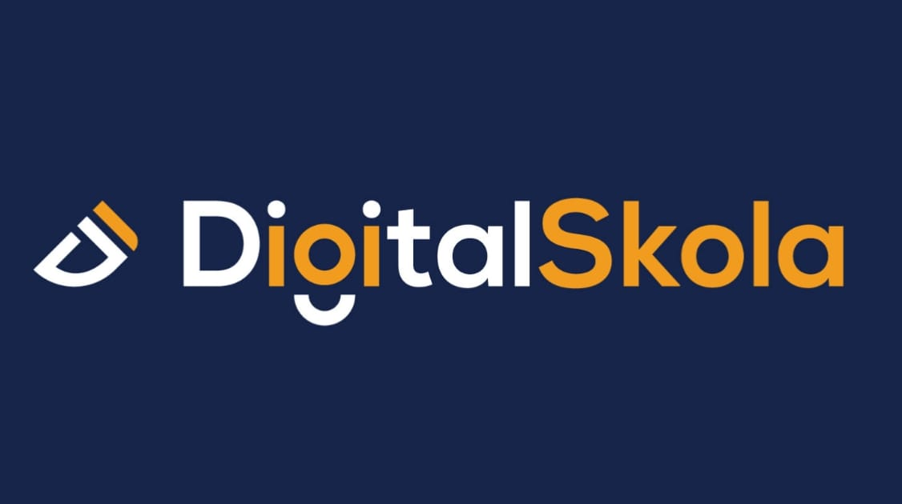

## Welcome Project Version Control System And Scm

Untuk menghentikan semua layanan dan menghapus container, network, dan volume yang dibuat:

```bash

docker-compose down --volumes

- **Error Handling**: Penanganan error disesuaikan dengan kemungkinan kesalahan yang dapat terjadi selama proses ETL, seperti kesalahan koneksi ke database atau kesalahan tipe data selama transformasi.
- **Running the ETL Process**: Dijelaskan bagaimana menjalankan DAG secara manual melalui UI Airflow.
- **Output**: Menguraikan tabel yang dihasilkan di PostgreSQL setelah proses ETL.

Jika Anda ingin menambahkan atau mengubah informasi tertentu, Anda bisa memperbarui file README.md sesuai kebutuhan.